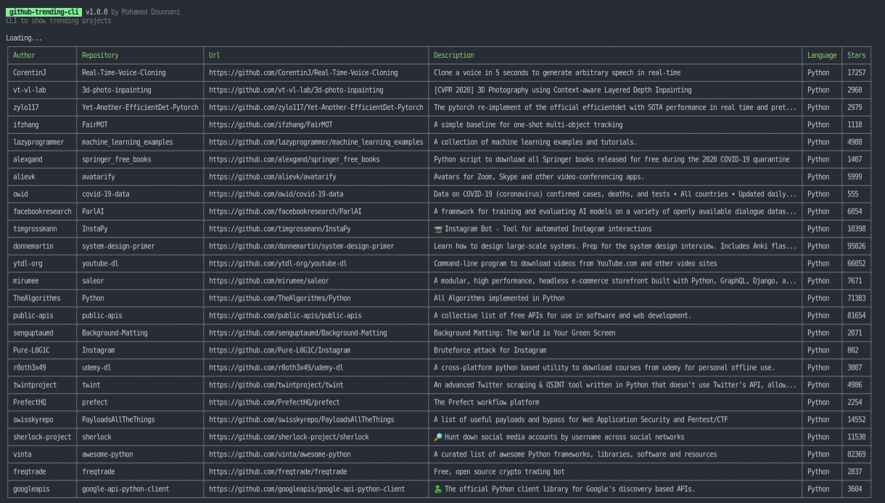

# github-trend-cli
CLI that shows trending projects on github

# Install
```shell script
foo-bar: $ npx github-trend-cli
```

# Usage
```shell script
foo-bar: $ npx github-trend-cli help
foo-bar: $ npx github-trend-cli javaScript dialy en
foo-bar: $ npx github-trend-cli python monthly any
foo-bar: $ npx github-trend-cli weekly any
```

# Example


# License
MIT